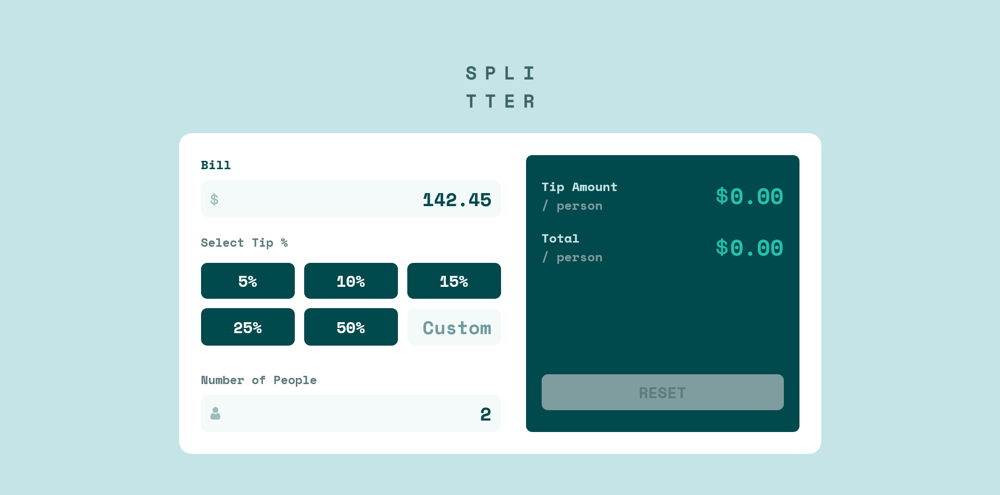
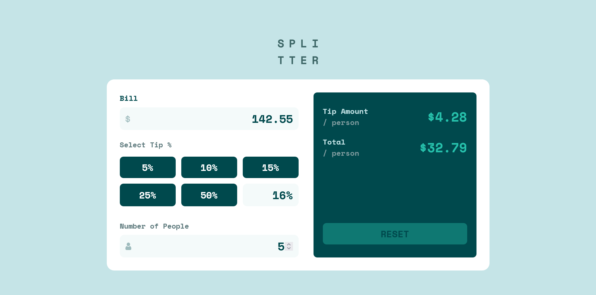

# Frontend Mentor - Tip calculator app solution

This is a solution to the [Tip calculator app challenge on Frontend Mentor](https://www.frontendmentor.io/challenges/tip-calculator-app-ugJNGbJUX). Frontend Mentor challenges help you improve your coding skills by building realistic projects.

## Table of contents

- [Overview](#overview)
  - [The challenge](#the-challenge)
  - [Screenshot](#screenshot)
  - [Links](#links)
- [My process](#my-process)
  - [Built with](#built-with)
  - [What I learned](#what-i-learned)
  - [Continued development](#continued-development)
  - [Useful resources](#useful-resources)
- [Author](#author)

## Overview

### The challenge

Users should be able to:

- View the optimal layout for the app depending on their device's screen size
- See hover states for all interactive elements on the page
- Calculate the correct tip and total cost of the bill per person

### Screenshot






### Links

- [Solution URL](https://www.frontendmentor.io/solutions/tip-calculator-app-uaQHYEfctQ)
- [Live Site URL](https://limsael.github.io/tip-calculator-app/)

## My process

### Built with

- Semantic HTML5 markup
- CSS custom properties
- Flexbox
- CSS Grid
- Mobile-first workflow
- JavaScript

### What I learned

```js
function calculateCustomTip() {
  if (customInputPercentage.value.endsWith("%")) {
    let customValue = customInputPercentage.value.substring(
      0,
      customInputPercentage.value.length - 1
    );

    const tip = (customValue * billAmount.value) / 100 / numberOfPeople.value;

    billTipAmount.textContent =
      "$" +
      ((customValue * billAmount.value) / 100 / numberOfPeople.value).toFixed(
        2
      );

    billTotalAmount.textContent =
      "$" + (billAmount.value / numberOfPeople.value + tip).toFixed(2);
  } else {
    const tip =
      (customInputPercentage.value * billAmount.value) /
      100 /
      numberOfPeople.value;

    billTipAmount.textContent = "$" + tip.toFixed(2);

    billTotalAmount.textContent =
      "$" + (billAmount.value / numberOfPeople.value + tip).toFixed(2);
  }
}
}
```


### Continued development

- The custom input calculator on Mobile

### Useful resources

- [Stack Overflow](https://www.stackoverflow.com)

## Author

- Frontend Mentor - [@limsael](https://www.frontendmentor.io/profile/limsael)
- Twitter - [@limsael525](https://www.twitter.com/limsael525)
